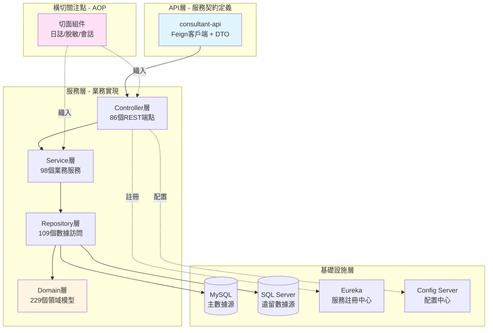

# Consultant 系統架構總覽

## 系統定位與核心價值主張

Consultant 系統是 vipabc/tutorabc 教育平台中負責顧問全生命週期管理的核心微服務系統。該系統旨在解決教育顧問（線上教師）從招聘申請、培訓認證、排班授課到薪資結算的完整業務流程管理需求。從技術生態定位來看,其扮演著連結招聘系統、課程調度系統、薪資核算系統以及學員評價系統的中樞角色,通過統一的顧問信息倉儲與業務規則引擎,確保跨系統的數據一致性與業務連貫性。

## 架構範式選擇

系統採用典型的微服務分層架構,結合 Spring Cloud 生態體系構建。整體設計遵循領域驅動設計(DDD)理念,將複雜的顧問業務邏輯劃分為清晰的領域邊界。採用該架構範式的根本原因在於業務的高度複雜性與團隊協作需求:顧問管理涉及敏感的個人信息、複雜的薪資計算規則、多變的合約條款以及頻繁的業務策略調整,分層架構確保了業務邏輯與基礎設施的解耦,使得核心業務規則可以在技術棧演進中保持穩定性。同時,微服務架構支持了系統的橫向擴展能力,能夠應對招聘季或課程高峰期的流量波動。

## 核心技術決策

系統的關鍵技術棧選型體現了對企業級可靠性與生態成熟度的重視。Spring Boot 作為基礎框架提供了約定優於配置的快速開發能力,而 Spring Cloud 的全家桶式組件(Eureka, Zuul, Feign, Hystrix)則確保了服務治理、負載均衡、熔斷降級等分佈式系統必備能力的開箱即用。在數據持久化層,系統同時整合 MySQL 與 SQL Server 雙數據源,這一設計決策源於歷史系統遷移與數據整合的實際需求:SQL Server 承載著遺留系統的核心業務數據,MySQL 則作為新系統的主力存儲,通過 MyBatis 靈活的 SQL 映射能力實現異構數據源的統一訪問。

值得注意的是,系統引入了 Druid 連接池與 Apache ShardingSphere 分片框架。Druid 不僅提供了高性能的連接管理,更重要的是其內建的監控與診斷能力為生產環境的性能調優提供了數據支撐。ShardingSphere 的引入則預示著系統對數據規模增長的前瞻性考量,通過分庫分表策略為未來的彈性擴展奠定了基礎。

## 頂層模塊劃分與協作機制

從Maven多模塊結構觀察,系統被劃分為 consultant-api 與 consultant-service 兩大核心模塊。consultant-api 定義了系統對外的服務契約,包含所有 DTO(數據傳輸對象)與 Feign 客戶端接口,扮演著服務邊界定義者的角色。這種契約優先的設計使得其他微服務可以通過依賴 consultant-api 模塊實現類型安全的遠程調用,而無需關注實現細節。consultant-service 則承載了完整的業務邏輯實現,內部進一步細分為 controller(表現層)、service(業務層)、repository(持久層)、domain(領域模型)等經典分層結構。

在內部協作機制上,系統採用了依賴注入與面向切面編程(AOP)相結合的方式。通過 Spring 容器管理組件生命週期,確保了各層之間的松耦合。AspectJ 切面則用於處理橫切關注點,如請求日誌記錄(APIRequestAdvice)、敏感信息脫敏(DesensitizedAspect)、會話令牌驗證(SessionTokenConfig)等。這一設計使得非功能性需求的實現與業務邏輯保持了清晰的隔離,體現了關注點分離原則的實踐。

## 架構圖示

## 設計哲學總結

整體而言,Consultant 系統的架構設計體現了務實主義與前瞻性的平衡。在技術選型上,優先選擇成熟穩定的企業級框架而非追逐新興技術,確保了生產環境的可靠性與社區支持的豐富度。在模塊劃分上,清晰的契約與實現分離、多層次的關注點隔離,為系統的可測試性與可維護性提供了有力保障。而在數據架構上,雙數據源整合與分片框架的引入,則展現了對歷史包袱與未來擴展的雙重考量。這種設計哲學使得系統既能支撐當前的業務需求,又為後續的演進留足了空間。
