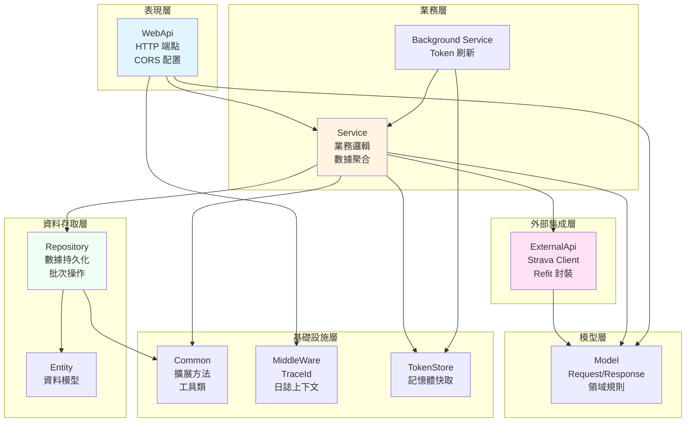

# 系統架構概述

## 專案定位與核心價值主張

Mtr.StravaConnect 系統作為一個運動訓練數據管理平台,致力於連接 Strava API 並提供訓練記錄的結構化管理與多維度分析能力。系統的核心價值在於將分散在 Strava 平台中的活動數據轉化為可追蹤、可分析的訓練計劃執行記錄,從而為運動員提供系統化的訓練管理工具。這一定位決定了系統必須在外部 API 整合、數據轉換、週期性背景作業等方面展現出穩健且高效的設計。

從技術生態的定位來看,該系統扮演著數據中台的角色,位於 Strava 原始數據源與前端應用之間,承擔數據擷取、清洗、轉換、聚合的全鏈路職責。系統採用了 RESTful API 作為對外服務的統一接口,使得前端應用能夠以標準化的方式存取處理後的訓練數據。這種架構定位確保了系統在多端應用場景下的可擴展性,同時將複雜的第三方 API 整合邏輯有效封裝在後端層級。

## 架構範式選擇與設計理念

系統採用了經典的分層架構範式(Layered Architecture),將職責明確劃分為表現層、服務層、資料存取層、外部集成層、模型層及共用工具層六個邏輯層級。這一範式的選擇源於對系統可維護性、可測試性以及團隊協作友好度的深度考量。分層架構通過強制實施單向依賴規則,確保高層模組不會因底層實現細節的變更而受到波及,從而大幅降低了系統演進過程中的風險成本。

在具體實現層面,系統嚴格遵循依賴倒置原則(Dependency Inversion Principle)。服務層與資料存取層之間通過介面契約進行解耦,使得核心業務邏輯不直接依賴於具體的資料庫實現。這一設計決策不僅提升了單元測試的可執行性,更為未來可能的資料庫遷移或多資料源支援預留了架構空間。值得注意的是,系統引入了專門的 ExternalApi 層來隔離第三方 API 的變動風險,這體現了防腐層(Anti-Corruption Layer)模式的應用智慧。

此外,系統在表現層採用了 ASP.NET Core 的最新 Minimal API 設計風格(從 [Program.cs](D:/workspace/side/Mtr.StravaConnect/Mtr.StravaConnect.WebApi/Program.cs) 可見),通過構造函數注入實現依賴管理,配合內建的依賴注入容器,構建了一個低耦合、高內聚的模組化系統。這種設計策略在簡化配置的同時,保持了對複雜業務場景的靈活應對能力。

## 核心技術決策

系統在技術棧選型上展現出對現代 .NET 生態的深度運用。選擇 ASP.NET Core 作為 Web 框架的根本原因在於其跨平台能力、高性能特性以及成熟的中介軟體管道機制。通過內建的依賴注入容器,系統得以優雅地管理元件生命週期,同時借助 Serilog 實現了結構化日誌記錄,為生產環境的可觀測性奠定了基礎。

在外部 API 整合方面,系統選用 Refit 框架作為 HTTP 客戶端抽象層。Refit 通過聲明式介面定義即可自動生成 HTTP 請求實現的特性,極大地簡化了與 Strava API 的整合代碼,減少了手動構建 HTTP 請求的樣板代碼。這一技術選型不僅提升了開發效率,更通過強類型約束降低了運行時錯誤的可能性。從 [IStravaApiClient.cs](D:/workspace/side/Mtr.StravaConnect/Mtr.StravaConnect.ExternalApi/ApiClient/StravaApiClient/IStravaApiClient.cs) 的實現可以看出,系統僅需定義介面方法並標註屬性,即可完成完整的 API 客戶端構建。

資料持久化層選擇 SQLite 作為嵌入式資料庫,配合 Dapper 微型 ORM 框架進行資料存取。這一組合的優勢在於輕量級部署與高性能查詢的完美平衡。SQLite 的無伺服器特性使得系統在 Docker 容器化部署時無需額外的資料庫服務依賴,降低了運維複雜度。Dapper 則提供了比 Entity Framework 更直接的 SQL 控制能力,在處理批次插入等性能敏感操作時能夠實現最優化的執行效率。從 [TrainingRecordRepository.cs](D:/workspace/side/Mtr.StravaConnect/Mtr.StravaConnect.Repository/TrainingRecordRepository.cs) 的批次 INSERT OR REPLACE 實現中,可以清晰看到系統對原生 SQL 的精細化運用。

在並發處理與背景任務方面,系統採用了 ASP.NET Core 的 IHostedService 機制實現 Token 的週期性刷新。[StravaTokenBackgroundService.cs](D:/workspace/side/Mtr.StravaConnect/Mtr.StravaConnect.Service/Background/StravaTokenBackgroundService.cs) 通過每五小時自動更新 Access Token 的策略,避免了因 Token 過期導致的服務中斷。這種背景服務模式與前台 API 服務共享同一進程空間,通過 Singleton 的 StravaTokenStore 實現記憶體內的 Token 快取,確保了各請求線程能夠即時獲取有效憑證。

## 頂層模塊劃分與協作機制

系統在頂層被劃分為八個邏輯單元,形成清晰的職責邊界。WebApi 專案作為系統的唯一入口,負責 HTTP 請求的接收與路由,其內部僅包含極簡的 Controller 層,真正的業務邏輯被下沉至 Service 層。這種設計使得表現層保持純粹的協議適配職責,避免了業務邏輯與協議細節的混雜。

Service 層作為業務核心,封裝了與 Strava 資料整合、訓練記錄處理、統計聚合等關鍵業務流程。從 [StravaService.cs](D:/workspace/side/Mtr.StravaConnect/Mtr.StravaConnect.Service/StravaService.cs) 的實現可以看出,該層負責編排多個下游依賴(Repository、ExternalApi、TokenStore),並實現複雜的業務規則,如跑步類型識別、訓練計畫週數計算、配速轉換等。這種富領域模型的設計策略確保了業務邏輯的內聚性,避免了貧血模型的缺陷。

Repository 層通過介面抽象提供資料存取能力,所有的資料庫操作均被封裝在此層內部。值得關注的是,系統在 Repository 層實現了智慧化的資料庫初始化邏輯,通過 [SqliteConnectionFactory.cs](D:/workspace/side/Mtr.StravaConnect/Mtr.StravaConnect.Repository/Infrastructure/SqliteConnectionFactory.cs) 在首次連線時自動建立表結構,這種設計使得系統具備開箱即用的能力,無需手動執行建表腳本。

ExternalApi 層專注於第三方服務的整合,目前僅包含 Strava API 客戶端。這一層的隔離設計具有戰略意義:當 Strava API 發生版本變更或需要接入其他運動平台時,變更範圍被嚴格限定在此層內部,不會波及上層業務邏輯。通過 Refit 的強類型介面定義,該層對外暴露的契約具有高度的穩定性。

Model 層橫跨所有其他層級,定義了系統的核心數據結構。該層包含了請求模型(Request)、響應模型(Response)、實體模型(Entity)以及共用的業務規則類(如 [RunType.cs](D:/workspace/side/Mtr.StravaConnect/Mtr.StravaConnect.Model/Shared/RunType.cs))。特別值得關注的是 RunType 的設計,其通過靜態只讀集合與樹狀繼承結構實現了訓練類型的標準化分類,體現了領域驅動設計中值對象(Value Object)模式的應用。

Common 層提供了系統級的擴展方法與工具類,如 [DateTimeExtensions.cs](D:/workspace/side/Mtr.StravaConnect/Mtr.StravaConnect.Common/Extensions/DateTimeExtensions.cs) 中的週數計算與時區轉換邏輯。這些工具方法通過擴展方法模式實現,使得業務代碼的可讀性顯著提升,同時避免了工具類方法的靜態依賴問題。

MiddleWare 層提供了橫切關注點的處理能力。[TraceIdMiddleware.cs](D:/workspace/side/Mtr.StravaConnect/Mtr.StravaConnect.MiddleWare/TraceIdMiddleware.cs) 實現了分散式追蹤標識的傳遞與注入,通過在請求管道中自動生成或透傳 TraceId,並將其推送至 Serilog 的日誌上下文中,實現了全鏈路的請求追蹤能力。這一設計為生產環境的問題定位提供了

關鍵的技術支撐。

各模塊間的協作遵循嚴格的單向依賴規則:WebApi 層僅依賴 Service 介面,Service 層向下依賴 Repository 與 ExternalApi,而底層模塊不會反向依賴上層。這種依賴拓撲確保了系統的變更衝擊能夠被控制在最小範圍內。通過依賴注入容器的運行時組裝,系統在保持鬆耦合的同時,實現了高效的協作機制。

從整體架構視角審視,Mtr.StravaConnect 展現出清晰的層次分離、明確的職責邊界以及優雅的技術選型。這種架構設計不僅滿足了當前的業務需求,更為未來的功能擴展與性能優化預留了充分的架構餘地。系統通過合理運用現代 .NET 生態的技術組件,構建了一個高內聚、低耦合、易維護的企業級應用架構。
